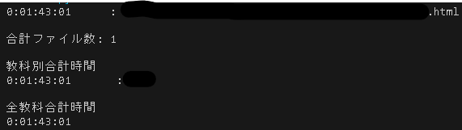

# N-Yobikou-TimesAndTests

Notice:

このコードの上位互換となるものが開発中で、近々このリポジトリはアーカイブされます。

新しいコードでは、より簡単により詳細な情報を取得することができるようになります。

[こちら](https://github.com/drago-suzuki58/N-Tools)のリンクよりダウンロードができるようになる予定ですので、ぜひブックマーク等どうぞ。


N予備校の教科の合計動画時間や、問題数を数えるためのプログラムです。

# 注意点

このプログラムはPythonを使用しています。システムにPythonがインストールされている環境でしか動きません。

また、Windows環境のみでしかテストしておりません。他の環境では動かない可能性もあるので予めご了承ください。

# 使い方

1. Releasesから最新バージョンのファイルをダウンロードする。

1. ダウンロードしたzipファイルを解凍し、適当なディレクトリに配置してください。

1. 内包されているdataフォルダの中にN予備校のhtmlファイルを保存してください。

    統計したいN予備校のページを開く。(下記の構造になっているページ)

    Ctrl+sまたは右クリックメニューから、「名前を付けて保存」をクリックする。

    そうすると下の画像のようなウィンドウが立ち上がるので先程のdataフォルダに保存してください。

    

    その際、ファイルの種類が3つありますが、必ず「ウェブページ、完全」を選ぶようにしてください。

    

    保存はどの教科を何個でもいいので、とりあえずぶち込んどけばなんとかなります。

1. 今度はコマンドプロンプトやPowerShellなどを開いてください。

    めんどくさい人は同じフォルダの中にあるRun.batをダブルクリックしてください。そしたら全部一気に出力されます。

    まず、以下のコマンドを打ち、解凍したディレクトリに移動します。

    ``` cmd
    cd 解凍したディレクトリ(各自で変えてください)\N-Yobikou-TimesAndTests
    ```

    次に、Pythonプログラムを実行するためのコマンドを打ちます。

    問題数を知りたい場合は、

    ``` cmd
    python N-Tests.py
    ```

    合計の動画時間を知りたい場合は、

    ``` cmd
    python N-Times.py
    ```

    合計の授業の動画時間を知りたい場合は、

    ``` cmd
    python N-Times-Class.py
    ```

    と打ってください。

    そうすると、問題数の場合は

    

    動画時間の場合は DD:HH:MM:SS形式で

    

    授業動画時間の場合は

    

    のように表示されます。

    ここでエラーが出たり、何も表示されない場合は、dataフォルダの中にあるファイルの拡張子が.htmlになっているかを確認してください。

    それでも治らない場合は環境のせいか、未知のバグなので教えてくだされば幸いです。

# 補足

授業動画時間と動画時間の違いについて、少しわかりにくいと思うので解説しておきます。

動画時間は、必修授業などで主に見ている「教材」の項目の中にある動画の合計時間のことで、(下図参照)


授業動画時間は、主に課外授業などでみられる右のようなものです。(下図参照)


# 最後に

機能の改善などありましたら、気軽にプルリクエストやフォークなどしていただいて構いません。

また、解説で分からない点があれば、修正しますのでメールなどでお伝えください。
